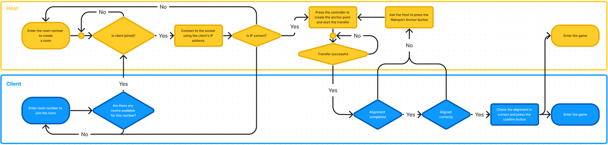
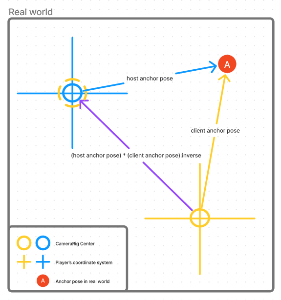

## Bouncing Duel MR
Copyright 2023-2024, HTC Corporation. All rights reserved.

## About
The Bouncing Duel MR is a new **Spatial Computing** technology game, 
made by our **Scene Perception** and **Spatial Anchor** features to bring a new XR experience.
All the virtual objects in game can be interactive with you. 
Bounce, Shoot, Dodge and Defence. Let's start a duel!

## Requirements
 - Vive XR Elite (ROM Version 1.0.999.568 above)
 - Unity 2021.3.16f1 (Build-In RP)
 - VIVE Wave XR Plugin 5.5.0-r.10
 - VIVE Input Utility 1.18.3

## Unity Internal Packages
 - Text Mesh Pro v3.0.6
 - Android Log Cat v1.3.2

## Third-Party Plugins
 - [DOTween v1.2.745](https://assetstore.unity.com/packages/tools/animation/dotween-hotween-v2-27676)
 - [Photon v2.44 Photon lib: 4.1.7.4](https://assetstore.unity.com/packages/tools/network/pun-2-free-119922)

## Usage & Build Setup
- Import Text Mesh Pro by Package Manager or add this `"com.unity.textmeshpro": "3.0.6"` into your manifest.json
- Import Third-Party Plugins [DOTween](https://assetstore.unity.com/packages/tools/animation/dotween-hotween-v2-27676) and [PUN2](https://assetstore.unity.com/packages/tools/network/pun-2-free-119922) from **Unity Asset Store**
- Apply a new [Photon](https://id.photonengine.com/zh-tw/account/signup?tabindex=5) account, and key-in your **AppID** into `Assets\Photon\PhotonUnityNetworking\Resources\PhotonServerSettings`
-   Set `Build Settings > Platform` to Android

## Environment Requirements
This MR experience will require a space for setting up spatial anchor and virtual objects. Here are some steps in **Vive XR Elite Launcher** and guidelines of how to judge a space qualifies for the game.
-   Ensure you have a space at least **5 square meters**.
-   Use the **Mixed Reality** found in **`Settings>Boundary`**. Scan the room, and ensure the mesh matches your room. In necessary, consider adding the wall objects to cover around.
-   Use the **View** found in **`Settings>Boundary`**. Ensure that the view direction of your HMD’s view is facing the wall which you want to forward (direction only, the center of the HMD can be different), to make sure that game objects will generated perfectly at the correct spot.
-   Regarding spatial anchors, please set the anchor at the spot with more features. **Avoid** the **transparent**, **spectacular** objects or the **single-color** planes.

## Network Specification
This multiplayer game necessitates a dependable and steady network environment. We utilize the Photon service for multiplayer gameplay and Socket for transferring spatial anchors data to another HMD. This entails ensuring that your HMDs are **connected to the same Wi-Fi access point (AP)**, and this AP must be **linked to the internet**.

## Game Flow and Alignment Method

## License
See [LICENSE.pdf](license.pdf) for more information.

## Contact Us
Email:  [ViveSoftware@htc.com](mailto:ViveSoftware@htc.com)